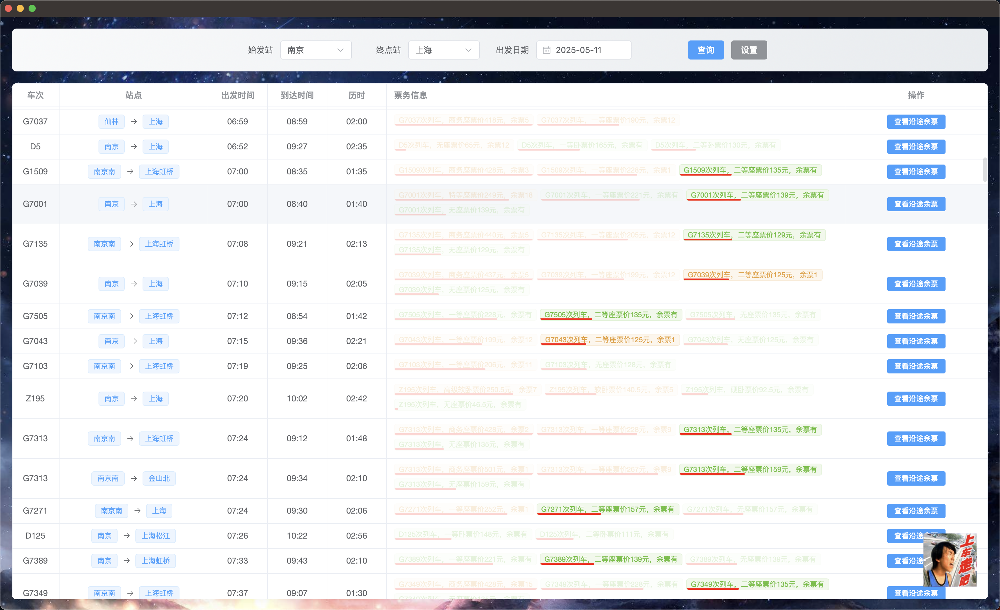
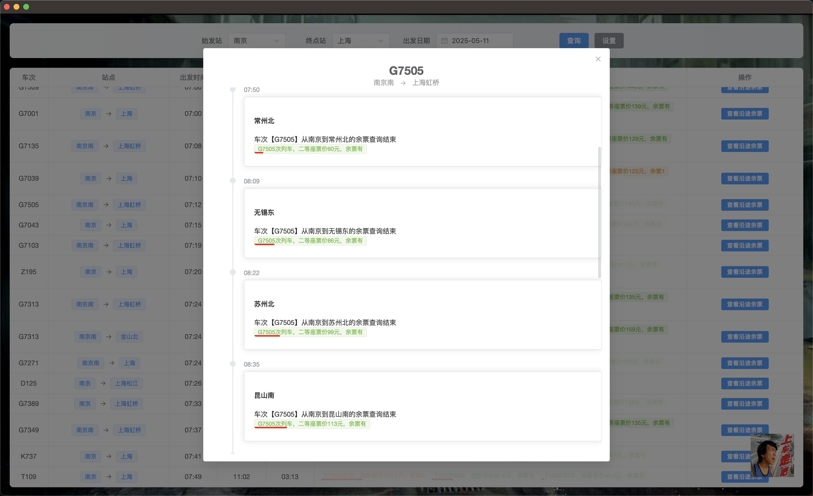

  

12306余票查询工具

## 📝 项目介绍

Let's Go 是一个基于 Tauri 和 Vue.js 开发的桌面应用程序，专门用于查询中国铁路 12306 的火车票信息。该工具提供了简洁直观的界面，帮助用户快速查询列车时刻表、车票余量以及沿途站点信息。

## 🛠️ 技术栈

- **Tauri**: Tauri 是一个用于构建跨平台桌面应用的工具。它提供了一个统一的 API，使开发者能够使用相同的代码库来构建 Windows、macOS 和 Linux 应用。
- **Vite 6**: Vite 6 是一个现代的前端构建工具，它使用了现代的 JavaScript 特性，如 ES Modules 和 Tree Shaking，来提高构建速度和性能。
- **Vue 3**: Vue 3 是一个流行的 JavaScript 框架，它使用了 Vue 3 的 Composition API 和响应式系统，来构建高效的用户界面。
- **TypeScript**: TypeScript 是一种静态类型的编程语言，它可以在编译时捕获错误，提高代码的可靠性和可维护性。

## 🖼️ 项目预览

## ✨ 功能列表

| 功能分类    | 功能名称     | 功能描述                                                         | 状态      |
| ----------- | ------------ | ---------------------------------------------------------------- | --------- |
| 🔍 **查询** | 列车查询     | 根据出发站、目的站和日期查询符合条件的列车                       | ✅ 已完成 |
|             | 沿途余票查询 | 查询列车在各个站点间的余票情况                                   | ✅ 已完成 |
| 📜 **显示** | 票务信息     | 查看各类座位（一等座、二等座、软卧、硬卧、硬座、无座）的余票情况 | ✅ 已完成 |
|             | 车次详情     | 显示列车的详细信息，包括发车时间、到达时间、历时等               | ✅ 已完成 |
|             | 沿途站点显示 | 显示特定列车的所有停靠站点                                       | ✅ 已完成 |
|             | 车票类型筛选 | 显示特定类型的票务信息                                           | ✅ 已完成 |
|             | 车票价格标识 | 价格越高，条幅越长，反之越短                                     | ✅ 已完成 |

| 🌐 **跨平台** | 多平台支持 | windows/macOS/linux | ✅ 已完成 |

## ⚖️ 注意事项

- 本应用仅用于个人学习和使用，请勿用于商业目的
- 查询频率过高可能导致 IP 被 12306 网站临时限制
- 应用显示的信息仅供参考，实际购票请以 12306 官方网站为准

## 🎖 贡献指南

欢迎提交问题报告和功能建议。如果您想贡献代码，请遵循以下步骤：

1. Fork 项目
2. 创建您的特性分支 ( git checkout -b feature/amazing-feature )
3. 提交您的更改 ( git commit -m 'Add some amazing feature' )
4. 推送到分支 ( git push origin feature/amazing-feature )
5. 打开一个 Pull Request
